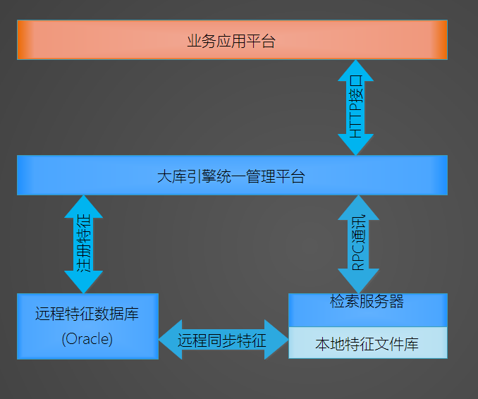
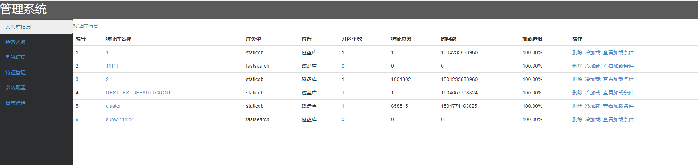
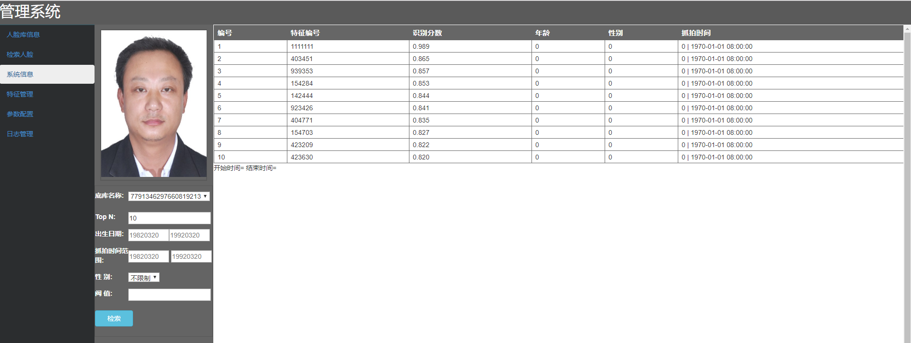
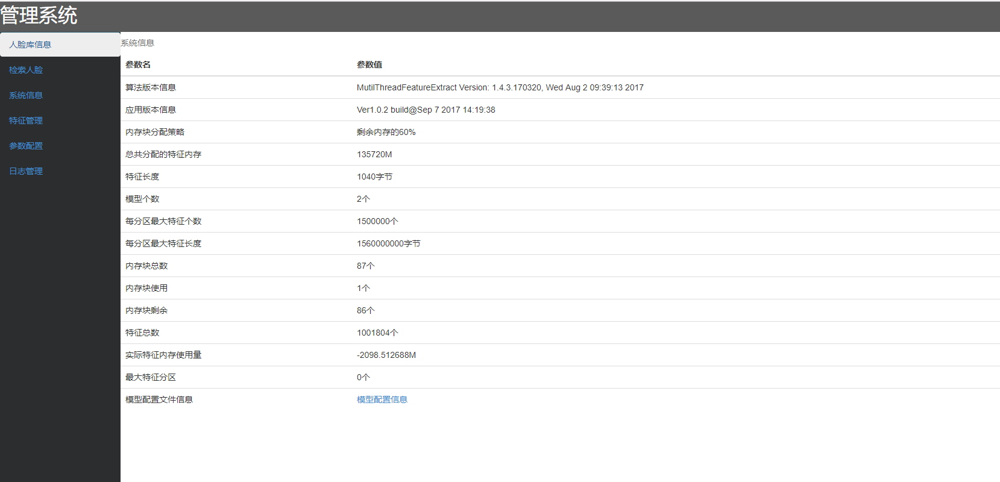
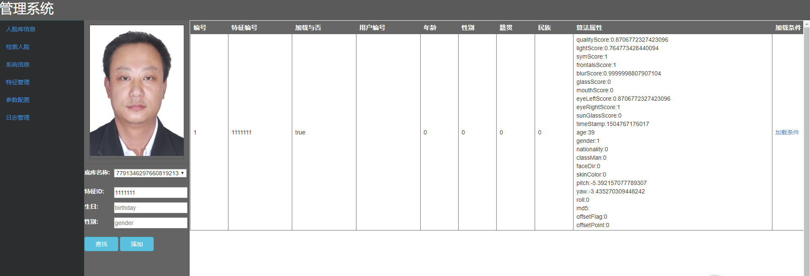
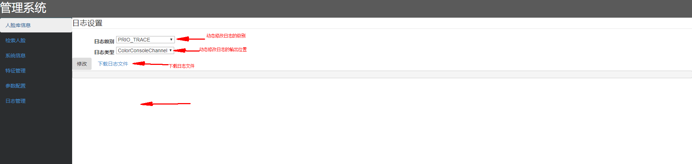

# 1.检索服务器功能及架构

检索服务器作为大库引擎的一部分，是单独作为一个服务存在的，采用RPC远程接口调用的
方式提供特征检索服务给大库引擎统一管理平台使用。

采用了以下几个关键性技术保证系统的大并发和高可用

* 为了最大程度的提高并发度，提高检索的速度，服务中采用了分库分区检索的技术，将一个大的人脸特征库
划分为多个子库，每个子库又划分为多个分区，同时将cpu核心数作为可分配的运算资源统一分配和管理，
在检索的时候，每个分区会调度到一个可管控的CPU核心去做并发检索，达到了最大CPU的最大利用化。

* 为了加快特征的加载速度，会将远程数据库中的特征先同步到检索服务器本地磁盘，同时对本地特征文件采用
了高可靠度的ECC校验算法，保证特征的完整和有效度，在远程特征未变更的情况下会优先加载本地特征，使得
特征的速度大大提升。

* 同时支持GPU和CPU检索，支持各种应用场景。

* 内置web管理后台，方便现场调试

# 2.对外接口和服务

- 特征加载
- 查询加载特征进度
- 创建底库
- 删除底库
- 增量添加人脸特征
- 增量删除人脸特征
- 删除指定底库全部人脸特征
- 查询指定特征库的人脸特征个数
- 查询所有特征库信息
- 查询指定类型的特征库
- 人脸检索

# 3.配置参数详细讲解

服务程序的应用目录下有一个facewarehouse.properties文件就是配置文件，里面有几个比较关键的参数

    feapath=./localfeature       #本地特征文件的存放目录，一般不需要修改，用默认的即可
    FeaNumPerPart=1500000  #每个特征库按这个参数值被分成n个子分区，检索是以子分区为单位进行检索
    MaxMemUsage=0.6   
    once_read_count=100000
    rpcport=9090
    recog_timeout=15

## 3.1 feapath(特征文件路径)

本地特征文件的存放目录，一般不需要修改，用默认的即可，（为了安全或者存储空间的其他原因，也可以把特征专门配置到其他目录）
默认值（./localfeature）

## 3.2 FeaNumPerPart（每个分区最大特征数)

每个特征库按这个参数值被分成n个子分区，检索是以子分区为一个线程单位进行并发检索的
默认值（1500000）

## 3.3 MaxMemUsage（最大预分配内存)

服务启动后会预先分配物理内存以便加载本地特征，有两种分配策略。
*  0<FeaNumPerPart<1 会按剩余内存百分比分配 ，分配剩余生成的百分之几
*  大于 1 会按实际物理内存大小M为单位，比如1000M，就是实际分配1000M，如果剩余内存不够，启动的时候会报错
默认（0.6）
## 3.4 once_read_count （单次读取大小)

* 从远处数据库拉取特征的时候，每次读取once_read_count个，一般不需要修改
默认值（10000个）

## 3.5 recog_timeout（识别超时时间)
每次检索最大超时时间，秒为单位
默认值（15s）

##3.6 rpcport（rpc监听端口)

rpc服务监听端口，引擎应用服务器会通过这个端口去请求检索服务，一般不需要修改
默认值(9000)

# 4.调试手段
检索服务内置一个基于web管理后台，可以用来查看检索服务内部状态和信息，以及通过动态调整
日志级别来跟踪故障原因。

 __管理后台的地址为: http://ip:22080/query/html__

## 4.1 人脸特征库管理

人脸特征库管理可以查看
* 1.总共加载到检索服务器中人脸特征库的个数
* 2.在本地特征库文件较大较多的时候，需要一定的加载时间，可以实时的查看每个库的加载进度
* 3.加载完毕后，可以查看已经加载的特征总数，以便和数据库中的特征数进行比对，检验两边的特征总数是否一致
* 4.库类型：static表示静态人脸库，fastdb表示动态人脸库
* 5.位置：内存库是只临时存储在内存中，服务重启后不保存，磁盘库会持久化到磁盘上.
* 6.分区个数：某个人脸库的总特征数/每个分区的特征数
* 7.时间戳：是用来同步本地特征库和远程特征库的时间标志，如果远程特征库有新增或者删除特征的行为，两边的特征同步时间戳
   会不一样，就会自动去同步两边的特征
* 常用操作
    * 冷加载：强制性全部同步远程和本地特征
    * 查看加载条件：本地特征加载前可以预先按某些条件过滤掉，这里可以查看过滤条件
    
## 4.2 人脸特征检索

这里可以做一个简单的检索测试

## 4.3 服务信息状态查看

这个页面可以查看
1.算法的版本号、检索服务模块的版本号和编译日期，确定现场是否是正确版本
2.内存分配策略，以及已经使用的内存数和分区数、剩余可使用的分区数
3.算法使用的模型的长度信息，确保模型正确
4.模型的配置文件信息查看，便于查看模型配置文件是否填写正确

## 4.4 特征管理

特征管理是用于查询某个特征ID的详细信息
*  加载与否：该特征是否在加载的时候就被过滤掉了，因为有过滤条件
*  用户编号：该特征ID对应的业务层的映射编号
*  年龄：该特征注册的年龄（预先录入的)
*  性别：该特征注册的性别
*  籍贯：该特征注册的籍贯
*  民族：该特征注册的民族
* 算法属性：这些属性不是人为录入，而是算法通过各个模型提取特征计算出来的属性值
    需要注意，如果在算法的配置文件中，某些属性开关没有打开，那么这里提取出来的属性值就是无效的

        实例和每个字段代表的含义
        "qualityScore":0.4, //人脸质量总分
        "lightScore": 0.5, ///<光照分，越大表示光照越适合				
        "symScore ":1.0;	///<对称分，越大表示光照越对称，0.5
        "frontalsScore": 1.0;	///<正脸分，越大表示脸越正，0.65
        "blurScore":1.0;		///< 清晰度分，越大表示越清晰，0.65
        "glassScore": 1.0;	///<是否带眼睛分数，越大表示越可能没带眼镜，0.5
        "mouthScore": 1.0;	///<闭嘴分数， 越大表示越可能是闭嘴，0.5
        "eyeLeftScore ":1.0;	///<左眼睁眼分数， 越大表示左眼越可能是睁眼，0.5
        "eyeRightScore ": 1.0;///<右眼睁眼分数， 越大表示右眼越可能是睁眼，0.5
        "sunGlassScore ":1.0;	///<戴墨镜的置信分，分数越高，表示戴墨镜的可能性越大，
        "pitch":10 ///抬头低头范围
        "yaw":10, //左右转头 （绝对值 
        "roll":10 , //平面内偏头（绝对值    
        过滤条件，满足条件的不加载.（默认值为0）
        "skinColor":0   肤色：1黄色，2黑色，4白色 过滤满足条件的人种 （多个类型可以求与后同时过滤）
        "gender":1, //性别 1男 2女 
        "classMan":  0, //人类型 1 小孩  2中年人 4 老人 多个人类型可以求与后同时过滤）
        "nation": 0, //国籍， 1 中国人 2 外国人

    
## 4.5 日志管理

为了方便查找和跟踪问题，程序提供了动态修改日志级别的功能，可以在网页上修改日志级别，不需要重新
启动应用程序，并且可以在页面上实时的查看日志输出，不需要用shell登陆系统，用命令行查看，方便现场
人员调试。

同时还提供一键下载日志文件到本地的功能，方便现场人员将日志发送会给开发工程师进行分析

# 5.常见问题及解决

